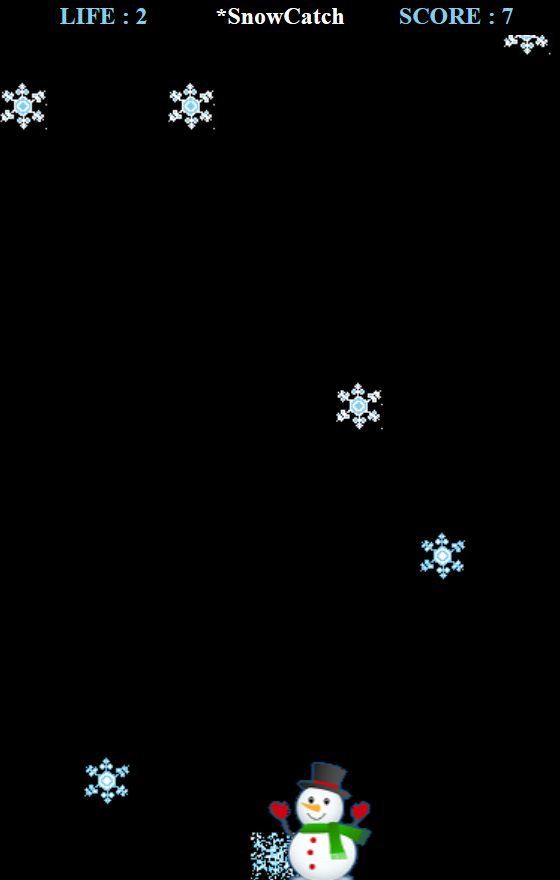

# HTML5 を使ったシンプルな 2D ゲームの作り方ハンズオン
(※)この記事は [monoe's blog](https://blogs.msdn.microsoft.com/osamum/2015/) の「[HTML5 を使ったシンプルな 2 D ゲームの作り方](https://blogs.msdn.microsoft.com/osamum/2015/04/24/html5-2-d/)」内容を ECMA Script 2016 の機能を加味して書き直したものです。

## 概要
*** 
HTML5 を使用したゲーム開発は、Canvas、SVG を使用した 2D ゲーム、WebGL を使用した 3D CG ゲームなどがありますが、このハンズオンでは、入門者向けに Canvas を使用したシンプルな 2D ゲームを開発し、JavaScript を使用したゲーム開発の基礎について学びます。

## 開発するゲーム
空から降って来る雪の結晶を雪だるまがキャッチするゲームです。

これを作成することにより Canvas でのアニメーションとキーボード、タッチによるスプライト(ゲームのキャラクター)の操作、当たり判定といったゲームの基本的にことを学ぶことができます。

## 要件
*** 
このラボを完了するには、以下のツールが必要です。　

* 以下のいずれかの最新の Web ブラウザー
  * [Microsoft Edge](https://www.microsoft.com/ja-jp/windows/microsoft-edge)
  * [Google Chrome](https://www.google.com/chrome/)
  * [Mozilla Firefox](https://www.mozilla.org/ja/firefox/new/)
  * [Apple Safari](https://www.apple.com/jp/safari/)
* [Visual Studio Code](https://code.visualstudio.com/)
* [Node.js](https://nodejs.org/ja/) 
* [ngrok](https://ngrok.com/download)

## ハンズオン
***
1.	[開発環境の準備とプロジェクトの作成](html5_game_HOL01.md)
2.	[Canvas への画像のロード](html5_game_HOL02.md)
3.	[基本的なアニメーションの実装](html5_game_HOL03.md)
4.	[矢印キーとタッチによる制御](html5_game_HOL04.md)
5.	[当たり判定](html5_game_HOL05.md)
6.	[複数 Sprite の生成とランダムな動作](html5_game_HOL06.md)
7.	[ヒット時の画像の切り替えと効果音の実装](html5_game_HOL07.md)
8.	[ルールの追加](html5_game_HOL08.md)
9.  [Progressive Web App 化](html5_game_HOL09.md)
