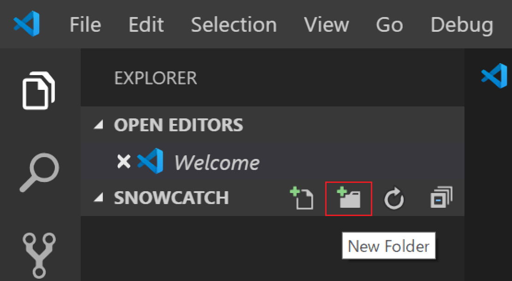
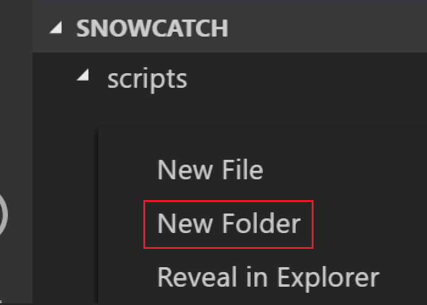
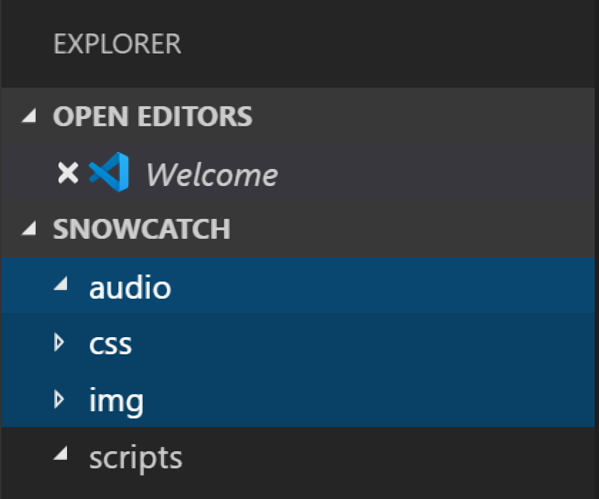
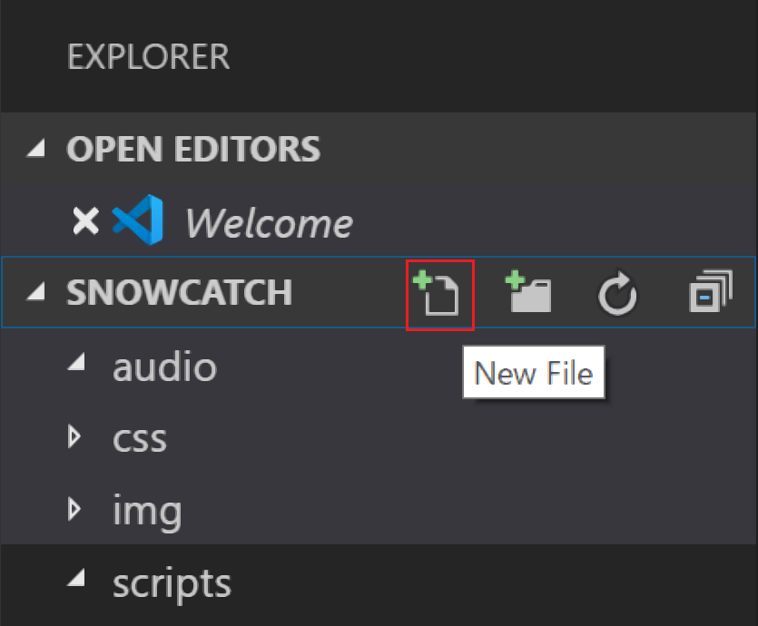
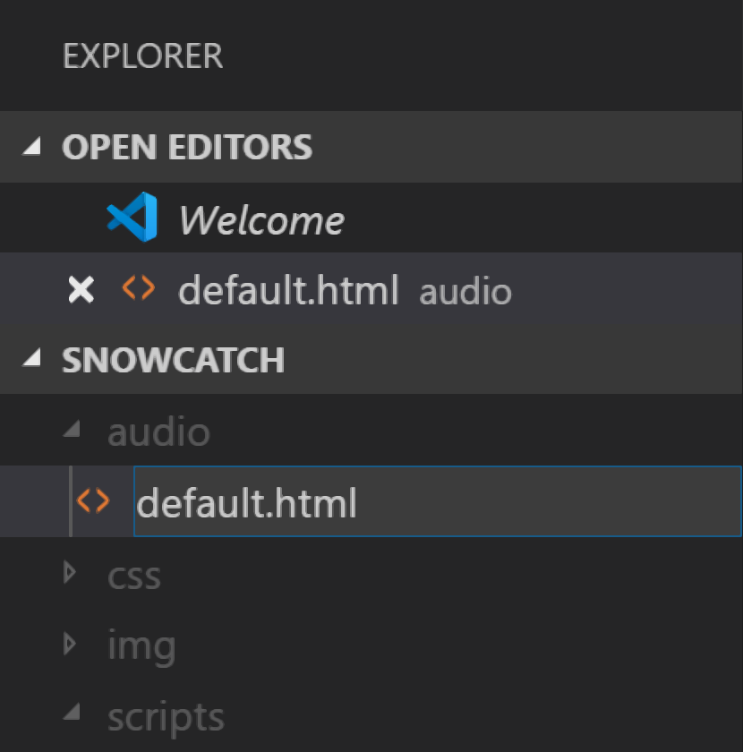

# 演習 1 : 開発環境の準備とプロジェクトの作成
開発を行うための環境の準備とプロジェクトの作成を行います。
## 開発環境の準備
開発作業に必要となるソフトウェアのインストールと設定を行います。

最初に、プログラムコードを記述するための Visial Studio Code をインストールします。
Windows、Mac、Linux それぞれの OS へのインストール方法については、以下の Visual Studio Code ファーストステップガイドの P.13 の内容を参照してください。
* [Visual Studio Code ファースト ステップ ガイド](http://download.microsoft.com/download/3/6/F/36FE7C6C-2CDB-44B1-AB66-079E6E9DD219/Visual_Studio_Code_1st_Step_Guide_FullContents.pdf) 　　

(※) 同ファーストステップガイドは 2015 年時点のものですが、基本的な部分の操作については現行の Visual Studio Code のものと大きく変わりません。

Web サーバーを Node.js を使用して動作させるので以下のリンク先ページより Node.js をインストールしてください。なお、使用するパッケージは「LTS」、もしくは「推奨版」と書かれているものを使用してください。
* [Node.js](https://nodejs.org/ja/)

Node.js のインストールが完了したら Windows の場合はコマンドプロンプト、Mac もしくは Linux の場合はターミナルを起動し、以下のコマンドを実行してバージョン番号が返ることを確認してください。

<p style="text-indent:2em">node -v</p>

ローカル環境で動作する Web サーバー [http-server](https://www.npmjs.com/package/http-server) をインストールします。

以下のコマンドを実行します。

<p style="text-indent:2em">npm install http-server -g</p>

htt-server の動作の確認はプロジェクトを作成した後で行うので、以上で開発環境の準備は完了です。

# プロジェクトの作成
コードを記述する前にプロジェクトを作成し、必要なファイルを追加します。

プロジェクトとは、1 つのアプリケーションを構成するためのプログラムコードやライブラリ、メディアなどのさまざまなファイルの集合と関係性を言います。
今回のハンズオンはブラウザー内で動作する Web のページですが、デスクトップアプリケーションであれは、1 つのプロジェクトが開発する 1 つの exe や dll に紐づきます。
　
## ルートディレクトリの作成
ハンズオンで使用するプロジェクトのルートディレクトリを以下の手順で作成します。

1. コマンドプロンプトを起動し、cd コマンドで作業ディレクトリを任意の場所に切り替えます
2. mkdir コマンドを使用してディレクトリ snowCatch を作成します
    <p style="text-indent:2em">mkdir snowCatch</p>
3. cd コマンドを使用して、作業ディレクトリを snowCatch に切り替えます
    <p style="text-indent:2em">cd snowCatch</p>
4. 以下のコマンドを使用して Visual Studio Code を起動します。
     <p style="text-indent:2em">code .</p>

## フォルダの作成
プロジェクトを構成するファイルを種類や役割ごとにまとめておくフォルダを作成します。

手順は以下の通りです。

1. Visual Studio Code の左側なある EXPLORER のツリーで「SNOWCATCH」にマウスポインタを載せ、表示されたフォルダアイコン (New Folderメニュー) をクリックし、scripts という名前でフォルダを作成します

    
2. 作成した scripts フォルダの下の余白で右クリックして [New Folder] メニューを選択し

    

    audio、css, img という 3 つのフォルダを作成します 

    

以上でこのプロジェクトで使用するフォルダが作成できました。

## ファイルの配置
Web ブラウザーで画面を描画するための html ファイルと書式を設定するための css ファイル、プログラムコードを記述するための js ファイル、それと画像やオーディオなどのファイルを準備します。
### メディア ファイルの入手と配置
プロジェクトで使用する画像やオーディオなどのアセットが含まれた zip ファイルを[このリンク](assets/html5gameHandsonAssets.zip)をクリックしてダウンロードしてください。

この zip ファイルには、画像(*.png)ファイルとオーディオ(*.mp3)ファイルが含まれているので、画像ファイルは、プロジェクト中の img フォルダに、オーディオファイルは audio フォルダにコピーします。
### ファイルの作成
コードやマークアップを記述するためのファイルを作成し、html ファイルに参照を記述します。
手順は以下の通りです。
1.	Visual Studio Code の画面左のフォルダツリーで snowCatch にマウスポインタをホバーするとツールバーが表示されるので、[New File] アイコンをクリックします

    

2. ファイル名を指定するボックスが表示されるので default.html と入力します

    

3. HTMLファイルに名前を付けると、画面右側にファイルの編集画面が表示されるので、ファイル編集画面で **!** と入力し [Tab] キーをクリックすると、基本的な HTML のタグが自動的に入力されます。
これは [Emmet](https://emmet.io/) と呼ばれる機能で、HTML や CSS を省略して入力することができます
4. html タグの lang 属性を 'en' から **'jp'** に変更し、[Ctrl] + [S] キーを押下して、変更を保存します
5. title タグの内容を Document から **SnowCatch HOL**  に変更します
6. title タグの下の行で **link** とタイプし、[Tab] キーを押下すると、link タグが挿入されるので、href 属性の値を **"css/default.css"** に書き換えます
7. css/default.css にハイパーリンクが付加されるので、[Ctrl] キーを押下しながらクリックします
8. 画面右下にファイルが存在しないことを示すダイアログボックスが表示されるので、同ダイアログボックス内の [Create File] ボタンをクリックします

9. default.html の編集画面で、title タグの下で **link** とタイプして [Tab]キーを押下すると、link タグが追加されるので href 属性の値を "./css/default.css" に書き換えます。

     css フォルダ内に default.css ファイルが作成され画面が開くので、以下のマークアップを張り付け、[Ctrl] + [S] キーを押下して保存します。
    ```
    body {
        margin: 0;
        touch-action: none;
        user-select: none;
        -webkit-touch-callout: none;
    }
    /*加点や失点を表示するボックス*/
    .statusBox {
        width: 134px;
        text-align: center;
        float: left;
        font-weight: bold;
        background-color: black;
        color:skyblue;
        padding: 3px;
    }
    /*タイトルを表示するボックス*/
    #centerBox {
        width: 89px;
        background-color: black;
        font-weight: bold;
        text-align: center;
        color: white;
        float: left;
        padding: 3px;
    }
    ```
10. default.html の編集画面で、link タグの下で **script** とタイプすると、入手候補がリスト表示されるので、リストから script:scr を選択します。なお、選択は矢印キーと [Tab] キーで行います
11. script タグが挿入されるので、scr 属性の値を **"scripts/default.js"** に書き換えます。
12. scripts/default.js にハイパーリンクが付加されるので、[Ctrl] キーを押下しながらクリックします
13. 画面右下にファイルが存在しないことを示すダイアログボックスが表示されるので、同ダイアログボックス内の [Create File] ボタンをクリックします

14. scripts フォルダ内に default.js ファイルが作成され画面が開くので、以下のコードを張り付け、[Ctrl] + [S] キーを押下して保存します。

    ```
    (function(){
    /*ここに演習 2 タスク 1 で変数を記述します。*/
    /*ここに演習 2 タスク 1 でドキュメントロード時のイベントハンドラを記述します。*/
    /*ここに演習 2 タスク 2 で Sprite クラス(関数) のインスタンスを格納するための変数オブジェクトを定義します*/
    /*ここに演習 6 タスク 1 で SNOWS_MOVING_CON オブジェクト変数を定義します。*/
    /*ここに演習 8 で Rule クラスを定義します*/
    /*ここに演習 2 タスク 1 で loadAssets 関数を記述します。*/
    /*ここに演習 4 タスク 1 で setHandlers 関数を記述します。*/
    /*ここに演習 2 タスク 2 で getCenterPostion関数を記述します。*/
    /*ここに演習 3 タスク 1 で renderFrame関数を記述します。*/
    /*ここに演習 4 タスク 1 で getRightLimitPosition関数を記述します。*/
    /*ここに演習 5 で isHit 関数を記述します。*/
    /*ここに演習 5 で hitJob 関数を記述します。*/
    /*ここに演習 6 タスク 2 で getRandomPosition 関数を記述します。*/
    /*ここに演習 6 タスク 3 で loadCheck 関数を記述します。*/ 
    })();

これでコーディングを開始するための必要なフォルダ構造とファイルが作成できました。

最後に作成した各ファイルが正しいフォルダに配置されているか確認してください。
* default.html → ルート
* default.css → css フォルダ
* default.js → scripts フォルダ


## HTTP のホスト環境の確認
開発したアプリケーションが、ローカル環境で HTTP で正しくホストされるかを確認します。

この段階では、default.html には Web ブラウザーで表示されるものはなにも記述していないので、同ファイルの body タグ内に以下のマークアップを張り付けます。
```
<div style="width:375px;margin:0px auto;">
    <div id="lifeBox" class="statusBox">LIFE:3</div>
    <div id="centerBox">*SnowCatch</div>
    <div id="scoreBox" class="statusBox" >SCORE:0</div>
    <div style="clear: both;"></div>
    <canvas id="bg" width="375" height="565" style="background-color:black;"></canvas>
</div>
```
> ### 備考 : Canvas のサイズ指定について
> Canvas のサイズ指定は CSS ではなく、必ずタグの属性で指定する必要があります。
それは Canvas の描画領域のサイズは、書式で指定される「表示されるサイズ」ではなく「描画を行うための領域の確保」だからです。
この描画領域の確保は、ブラウザが Canvas タグを解釈したと同時に行われます。よって、Canvas タグにサイズに対する指定が無いと、Canvas の既定の サイズである width 300px、height 150px で描画領域が確保されます。これに対し、CSS でサイズを指定すると、CSS で指定されたサイズで引き延ばすか圧縮された形になりアスペクト比が同じでない限り意図したとおりに描画されませんので注意が必要です。

[Ctrl] + [S] キーを押下して変更を保存したら以下の手順で Web サーバーを起動し、Web ブラウザーからアクセスします。

1. Visual Studio Code のメニュー **[Terminal] - [New Terminal]** をクリックします
2. 画面下部にターミナルウインドウが表示されるので、同ウィンドウ内で以下のコマンドを実行してシェルを Command Prompt に変更します

    <p style="text-indent:2em;font-weight:bold;">cmd</p>

3. ターミナルウインドウで以下のコマンドを実行します
    <p style="text-indent:2em">http-server</p>
4. Web ブラウザーを起動し、以下の URL にアクセスします
    <p style="text-indent:2em">
    <a href="http://127.0.0.1:8080/default.html">http://127.0.0.1:8080/default.html</a></p>


Web ブラウザーに黒い四角が表示されたら完了です。

http-server のサービスを終了するにはキーボードの [Ctrl] + [C] キーをクリックします。

## インターネットからのアクセスを可能に
ngrok というツールを使用して、ローカルの http-server がホストする Web サイトに一時的にインターネットからアクセスできるようにします。

ngrok を [ダウンロード](https://ngrok.com/download) して ngrok.exe を任意のフォルダーに配置してください。

ngrok を使用してインターネットから前の手順で作成した default.html にアクセスするには以下の手順を実行します。

1. Visual Studio Code の ターミナルウインドウで以下のコマンドを実行します
    <p style="text-indent:2em">http-server</p>

2. Web ブラウザーを起動し、以下の URL にアクセスして、http-server が正常にコンテンツをホストしていることを確認します
    <p style="text-indent:2em">
    <a href="http://127.0.0.1:8080/default.html">http://127.0.0.1:8080/default.html</a></p>
3. コマンドプロンプトを起動し、cd コマンドで作業ディレクトリを ngrok.exe が配置されているディレクトリに切り替えます
4. 以下のコマンドを実行します
    <p style="text-indent:2em">ngrok http 8080 --host-header=localhost</p>
5. エコーされた内容の Foewarding の横に表示された http、もしくは https のドメイン名を使用してアクセスします

    
    たとえば、ngrok から返されたドメイン名が http://9fcf38b6.engrok.io だった場合は以下の URL でインターネットからローカルの default.html にアクセスすることができます。
    <p style="text-indent:2em">http://9fcf38b6.engrok.io/default.html</p>

PC、もしくはスマートフォンの Web ブラウザーからアクセスして、ページが表示されることを確認してください。

engrok の実行をを終了するにはキーボードの [Ctrl] + [C] キーをクリックします。

なお、engrok は起動する毎にドメイン名が変わるので、作業中は起動したままのほうが良いかもしれません。

以上、本ハンズオンの準備は完了です。

### 目次
[2. Canvas への画像のロード](html5_game_HOL02.md)

[3. 基本的なアニメーションの実装](html5_game_HOL03.md)

[4. 矢印キーとタッチによる制御](html5_game_HOL04.md)

[5. あたり判定](html5_game_HOL05.md)

[6. 複数 Sprite の生成とランダムな動作](html5_game_HOL06.md)

[7. ヒット時の画像の切り替えと効果音の実装](html5_game_HOL07.md)

[8. ルールの追加](html5_game_HOL08.md)

[0. 最初に戻る](README.md)


