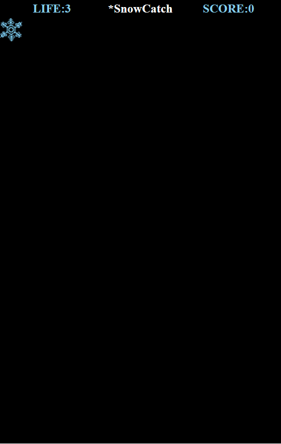
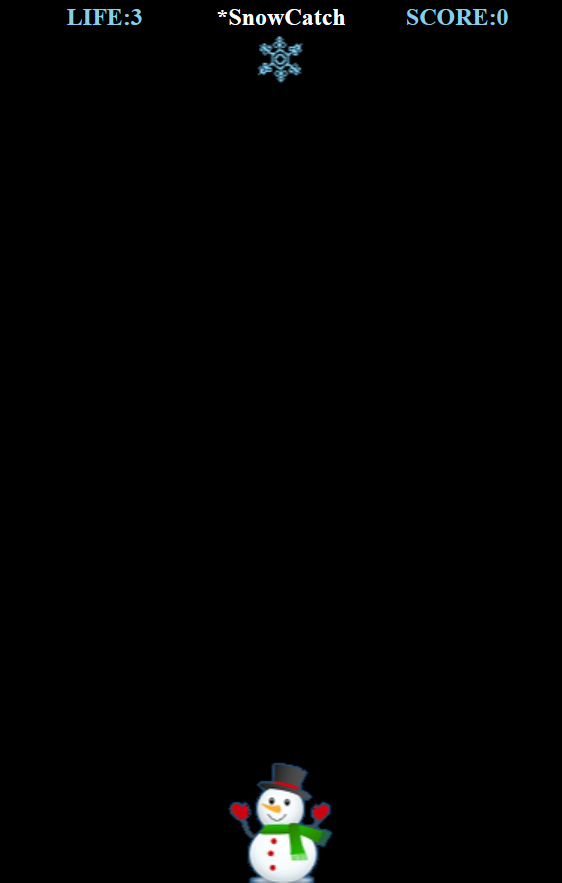

# 演習 2 : Canvas への画像のロード
JavaScript を使用し、default.html 上の Canvas に img フォルダ内の雪の結晶の画像(snow.png)をロードします。
## タスク 1 – 変数の定義と loadAssets 関数の定義
このタスクで行う作業は以下の 2 つです。
*  Canvas と、その上に表示される画像のインスタンスを格納するための、ゲーム全体で使用する変数を定義します
*  ページの準備ができた際に動作するイベントハンドラと、その中から呼ばれる必要なリソースを読み込む loadAssets 関数を定義します

具体的な手順は以下のとおりです。
1. Visual Studio Code のツリービューで **default.js** をダブルクリックで開き、コメント「**/* ここに演習 2 タスク 1 で変数を記述します。*/**」を以下の記述で上書きします。
    ```
    //全体で使用する変数
    /*ここに演習 4 タスク 1 で変数を追加します。*/
    //全体で使用する変数
    let canvas;
    let ctx;
    let img = {snow:null,snow_man:null};
    let requestId;
    ```
    コードを張り付けてインデントが崩れたら **[Alt] + [Shift] + [F]** キーを押下して体裁を整えます。

2. DOM の読み込みが完了した際の以下のイベントハンドラを追加します。
    コメント「**/ *ここに演習 2 タスク 1 でドキュメントロード時のイベントハンドラを記述します。*/**」を以下の記述で上書きします。
    ```
    //DOM のロードが完了したら実行      
    document.addEventListener('DOMContentLoaded', ()=> { 
        loadAssets(); 
        /*ここに演習 4 タスク 1 で setHandlers 関数の呼び出しを記述します*/
    });
    /*ここに演習 2 のタスク 2 で Sprite クラスを定義します*/
    ```
    コードを張り付けてインデントが崩れたら **[Alt] + [Shift] + [F]** キーを押下して体裁を整えます。

3. Canvas に画像をロードするための loadAssets 関数を記述します。

    コメント「**/* ここに演習 2 タスク 1 で loadAssets 関数を記述します。*/**」を以下の記述で上書きします。
    ```
    //ゲームに必要なアセットをロードする
    function loadAssets() { 
        /*ここに演習 8 で Rule クラスのインスタンスを生成するコードを記述します*/
        //HTML ファイル上の canvas エレメントのインスタンスを取得   
        canvas = document.getElementById('bg'); 
        /*ここに演習 3 タスク 1 で Click イベントハンドラ処理を追加します*/
        //2D コンテキストを取得  
        ctx = canvas.getContext('2d');
        //image オブジェクトのインスタンスを生成  
        img.snow = new Image();
        //image オブジェクトに画像をロード 
        img.snow.src = './img/snow.png';
        /*画像読み込み完了の Canvas に 
        画像を表示するメソッドを記述 */
        img.snow.onload = ()=> { 
            /*ここは演習 2 タスク 2 でハンドラ内のコードを書き換えます*/
            //canvas 上で image を描画  
            ctx.drawImage(img.snow, 0, 0);  
        }; 
        //ここに演習 2 タスク 3 の雪だるま画像をロードする処理を記述します。
    };
    ```
4. **[Ctrl] + [S]** キーを押下して作業内容を保存します。
5. Visual Studio Code のターミナル画面から http-server を起動し、以下の URL にアクセスします。
    <p style="text-indent:2em">
    <a href="http://127.0.0.1:8080/default.html">http://127.0.0.1:8080/default.html</a></p>

以下の画像が表示されれば完了です。




## タスク 2 – Sprite オブジェクトの定義
タスク 1 では画像をそのまま image オブジェクトで扱いましたが、これではゲームで使用するオブジェクト固有のプロパティやメソッドを実装するのに不便な点があります。
この演習では、ゲーム内のキャラクターを扱うための Sprite オブジェクトのクラスを定義します。

1. Sprite クラスを定義します。コメント「**/* ここに演習 2 のタスク 2 で Sprite クラスを定義します*/** 」を以下の記述で上書きします。
    ```
    //Sprite クラスの定義 
    class Sprite {
        constructor(img) {
            this.image = img; //image オブジェクト 
            this.height = img.height;
            this.width = img.width;
            this.x = 0; //表示位置 x 
            this.y = 0; //表示位置 y 
            this.dx = 0; //移動量 x 
            this.dy = 0; //移動量 y
            /*ここに演習 7 のタスク 2 でオーディオ再生用の
           プロパティが追加されます*/ 
            /*ここに演習 7 のタスク 1 で Getter と Setter の
           コードが追加されます*/
            //Sprite を描画するメソッド 
            this.draw = ()=> {
                ctx.drawImage(img, this.x, this.y);
            };
        }
    }
    ```
    コードを張り付けてインデントが崩れたら **[Alt] + [Shift] + [F]** キーを押下して体裁を整えます。

2. 生成された Sprite クラスのインスタンスを格納するための変数を先ほど定義した Sprite 関数の定義の前にあるコメント「**/* ここに演習 2 タスク 2 で Sprite クラス(関数) のインスタンスを格納するための変数オブジェクトを定義します*/**」以下のように記述します。
    ```
    //Sprite を扱う変数オブジェクト
    let sprite = {
        //雪の結晶 Sprite が格納
        snow: null,
        //雪だるまの Sprite が格納
        snow_man: null
    };
    ```
    コードを張り付けてインデントが崩れたら **[Alt] + [Shift] + [F]** キーを押下して体裁を整えます。

3. 定義した Sprite クラスを使用するように **loadAssets** 関数の **img.snow.onload** イベント ハンドラの内容を以下のように完全に書き換えます。
    ```
     img.snow.onload = ()=> { 
       /*このハンドラの処理は演習 6 のタスク 1 手順 3 で書き換えます*/
       /*ここは演習 7 のタスク 1 手順 3 で変更されます*/
       //画像を引数に Sprite クラスのインスタンスを生成  
      sprite.snow = new Sprite(img.snow);
      sprite.snow.x = 0; //ここは演習 2 タスク 3 で書き換えます
      sprite.snow.y = 0;
      //Sprite オブジェクトに定義した draw メソッドで描画
      sprite.snow.draw(); 
    }; 
    ```

3. **[Ctrl] + [S]** キーを押下して作業内容を保存します。
4. Visual Studio Code のターミナル画面から **http-server** を起動し、以下の URL にアクセスします。
    <p style="text-indent:2em">
    <a href="http://127.0.0.1:8080/default.html">http://127.0.0.1:8080/default.html</a></p>

タスク 1 と同じ表示がされれば完了です。

表示は同じですが sprite クラスを使用して描画されています。
　
　 
## タスク 3 : 画像の表示位置の調整
現在 Canvas の左上に表示されている画像が中央に表示されるようにします。

画像の中央の位置を求める **getCenterPostion** 関数を定義し、同関数から得られた値を Spriteに設定します。

以下の手順で **default.js** にコードを追加します。

1. **loadAssets** 関数の閉じ括弧の下のコメント「**/* ここに演習 2 タスク 2 で getCenterPostion関数を記述します。*/**」を以下のコードで置き換えます
    ```
    //中央の Left 位置を求める関数 
    function getCenterPostion(containerWidth, itemWidth) { 
        return (containerWidth/2) - (itemWidth/2); 
    };
    ```
    コードを張り付けてインデントが崩れたら **[Alt] + [Shift] + [F]** キーを押下して体裁を整えます。

2. **loadAssets** 関数内にある **img.snow.onload** イベントハンドラの内容を、先ほど定義した **getCenterPostion** 関数を使用して書き換えます。
    具体的には **sprite.snow.x** の値を設定している箇所です。コメント「**//ここは演習 2 タスク 3 で書き換えます**」を目印にしてください。
    ```
    img.snow.onload = ()=> { 
        /*このハンドラの処理は演習 6 のタスク 1 手順 3 で書き換えます*/
        /*ここは演習 7 のタスク 1 手順 3 で変更されます*/
        //画像を引数に Sprite クラスのインスタンスを生成  
        sprite.snow = new Sprite(img.snow);

        //以下の行が書き換え箇所です
        sprite.snow.x = getCenterPostion(canvas.clientWidth, sprite.snow.width);
        sprite.snow.y = 0;
        //Sprite オブジェクトに定義した draw メソッドで描画
        sprite.snow.draw(); 
    };
    ```
3. [Ctrl] + [S] キーを押下して作業内容を保存します。
4. Visual Studio Code のターミナル画面から http-server を起動し、以下の URL にアクセスします。
    <p style="text-indent:2em">
    <a href="http://127.0.0.1:8080/default.html">http://127.0.0.1:8080/default.html</a></p>

雪の結晶の画像が Canvas の中央に表示されるか確認してください。


もしうまくいかない場合は[このコード](https://gist.github.com/osamum/754de15ab68f976b36e0b8d8243d9321)を参考にしてください。


## タスク 4 : 雪だるまの追加
Canvas の下端中央に雪だるまの Sprite を追加します。処理的には雪の結晶 Sprite を配置する処理と大きく変わるところはありません。

コードの追加手順は以下のとおりです。

1. **loadAssets** 関数内のコメント「**//ここに演習 2 タスク 3 の雪だるま画像をロードする処理を記述します。**」を以下のコードで置き換えます
    ```
    //雪だるまインスタンスの生成 
    img.snow_man = new Image(); 
    img.snow_man.src = './img/snow_man.png'; 
    img.snow_man.onload = ()=> { 
        /*このハンドラの処理は演習 6 のタスク 1 手順 3 で書き換えます*/
        sprite.snow_man = new Sprite(img.snow_man);
        sprite.snow_man.x = getCenterPostion(canvas.clientWidth, sprite.snow_man.width); 
        //雪だるま画像は、表示領域の底辺に画像の底辺がつくように 
        sprite.snow_man.y = canvas.clientHeight - sprite.snow_man.height;
        /*ここに演習 4 のタスク 1 で 
        getRightLimitPosition 関数を使用した処理を記述します*/
        sprite.snow_man.draw(); 
    };
    ```
    コードを張り付けてインデントが崩れたら **[Alt] + [Shift] + [F]** キーを押下して体裁を整えます。

2. **[Ctrl] + [S]** キーを押下して作業内容を保存します。
3. Visual Studio Code のターミナル画面から http-server を起動し、以下の URL にアクセスします。
    <p style="text-indent:2em">
    <a href="http://127.0.0.1:8080/default.html">http://127.0.0.1:8080/default.html</a></p>

雪だるまの画像が以下のように Canvas の中央下端に表示されるか確認してください。



ここまでの default.js の完全なコードは以下になります。

[⇒ HTML5 game and PWD HOL Ex2 sample code](https://gist.github.com/osamum/754de15ab68f976b36e0b8d8243d9321)

### 目次
[3. 基本的なアニメーションの実装](html5_game_HOL03.md)

[4. 矢印キーとタッチによる制御](html5_game_HOL04.md)

[5. 当たり判定](html5_game_HOL05.md)

[6. 複数 Sprite の生成とランダムな動作](html5_game_HOL06.md)

[7. ヒット時の画像の切り替えと効果音の実装](html5_game_HOL07.md)

[8. ルールの追加](html5_game_HOL08.md)


[0. 最初に戻る](README.md)

[1. 開発環境の準備とプロジェクトの作成](html5_game_HOL01.md)