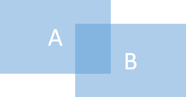

# 演習 5: あたり判定
ゲームのキャラクター同士が接触した際の判定ロジックを記述し、「あたり」判定された際には文字を表示します。

## タスク : あたり判定の実装と文字の表示
「あたり判定」の判定方法や考え方は様々なものがありますが、ここでは単純な画像の重なりによる判断を使用して実装します。
「あたり」と判定された場合には画面中央に文字を表示します。

手順は以下のとおりです。
1. 二つの画像の重なりを判定するための **isHit** 関数を以下のように記述します。
    default.js の下の方にあるコメント「**/* ここに演習 5 で isHit関数を呼び出すコードを追加します*/**」を以下のコードで置き換えます。
    ```
    //あたり判定処理
    function isHit(targetA,targetB){
        return (((targetA.x <= targetB.x && targetA.x + targetA.width > targetB.x) 
            ||(targetB.x <= targetA.x && targetB.x + targetB.width  > targetA.x)) 
        &&((targetA.y <= targetB.y && targetA.y + targetA.height  >=  targetB.y) 
            ||(targetB.y <= targetA.y && targetB.y + targetB.height  >=  targetA.y)));
    }
    ```
2. 「あたり」と判定された際に文字を表示する hitJob 関数を記述します。
    **isHit** 関数の定義の下にあるコメント「**/* ここに演習 5 hitJob関数を呼び出すコードを追加します*/**」を以下のコードに置き換えます。
    ```
    //あたり判定の際の処理
    function hitJob() {
        ctx.font = 'bold 20px sans-serif';  
        ctx.fillStyle = 'red'; 
        ctx.fillText('ヒットしました', getCenterPostion(canvas.clientWidth, 140), 160);
        /*ここに演習 8 で gameRule.catched 関数を記述し、上の 3 行は削除します*/ 
        /*ここに演習 7 のタスク 1 で画像を変更するコードを追加します*/ 
        /*ここに演習 7 タスク 2 手順 3 でオーディオを再生するコードを追加します*/ 
    }
    ```
3. 画面の書き換えを行う **renderFrame** 関数内に **isHit** 関数を呼び出すコードを記述します。

    **renderFrame** 関数内のコメント「**/*　ここに演習 5 isHit関数を呼び出すコードを追加します*/**」を以下のコードで置き換えます。
    ```
    //あたり判定
    if(isHit(sprite.snow,sprite.snow_man)){hitJob()};
    ```
4. **[Ctrl] + [S]** キーを押下して作業内容を保存します。
5. Visual Studio Code のターミナル画面から http-server を起動し、以下の URL にアクセスします。
    <p style="text-indent:2em">
    <a href="http://127.0.0.1:8080/default.html">http://127.0.0.1:8080/default.html</a></p>
6. Canvas 部分をクリックし、雪の結晶と雪だるまが重なったときに「ヒットしました」と表示されるのを確認してください。

ここまでの default.js の完全なコードは以下になります。

[HTML5 game and PWD HOL Ex5 sample code](https://gist.github.com/osamum/0acd43c12e00aa0811ab21b95b2b1d2d)

実際のコードの動作を確認したい場合は[ここ](https://osamum.github.io/HTML5Game_and_PWA_Handson/results/ex5/default.html)をクリックしてください。

⇒ 次の「[**6. 複数 Sprite の生成とランダムな動作**](html5_game_HOL06.md)」に進む

# 解説
## 当たり判定
「当たり判定」とは、文字どおりゲームにおいてキャラクター同士が衝突したかどうかを判断するもので、シューティングゲームのような、ユーザーがゲーム内のキャラクターを操作するタイプのゲームでは不可欠なものです。

当たり判定の方法はいろいろあり、形状が複雑なものに対し厳密に行おうとすると非常に大変です。また、実際のそこまでは必要がないということもあります。例えば、以下の図のアミカケの部分は、当たり判定をする単純な 3 つのパターンを示してしますが、X と Y の値で判断できる 1 や 2 が簡単です。


このハンズオンのゲームでは、最も単純な 1 のタイプで、2 つの画像が重なったら当たりと判定する方法で実装しています。



この判断は以下の式で行うことができます。
```
当たり/はずれ = ((targetA.x <= targetB.x and targetA.width + targetA.x >= targetB.x) 
     or  (targetA.x >= targetB.x and targetB.x + targetB.width >= targetA.x) ) 
    and ( (targetA.y <= targetB.y and targetA.height + targetA.y >= targetB.y) 
    or (targetA.y >= targetB.y and targetB.y + targetB.height >= targetA.y))
```
このハンズオンのゲームでは、isHit 関数として実装していますのでデバッガをアタッチするなどして動作を確認してください。


### 目次

[6. 複数 Sprite の生成とランダムな動作](html5_game_HOL06.md)

[7.ヒット時の画像の切り替えと効果音の実装](html5_game_HOL07.md)

[8. ルールの追加](html5_game_HOL08.md)


 
[0. 最初に戻る](README.md)

[1. 開発環境の準備とプロジェクトの作成](html5_game_HOL01.md)

[2. Canvas への画像のロード](html5_game_HOL02.md)

[3. 基本的なアニメーションの実装](html5_game_HOL03.md)

[4. 矢印キーとタッチによる制御](html5_game_HOL04.md)


