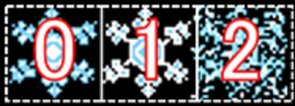
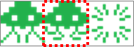

# 演習 7 : ヒット時の画像の切り替えと効果音の実装
あたり判定時の画像の切り替えと効果音の再生機能を実装します。
## タスク 1 : 降雪時の画像の切り替えとあたり判定時の画像の変更
あたり判定時に、以下のような 1 ファイルに収められた複数の図案から任意のものを表示して画像を切り替えます。この方法は「スプライト」と呼ばれますが、ゲームプログラミングで慣例的に使用されるゲーム内のキャラクターを表す「Sprite」とは別のものです。



1. 雪の結晶の動作が使用する定数 **NOWS_MOVING_CONF** の定義に、スプライトとして切り出す画像の内容と、インデックスを示す定数と切り出す画像のサイズ、画像の切り替えに使用する変数などを定義します。

    具体的には **NOWS_MOVING_CONF** 内にあるコメント「**/* ここに演習 7 タスク 1 で switch_count プロパティを記述します。*/**」を以下のコードで置き換えます。
    ```
    //雪の結晶画像を切り替える閾値  
    switch_count : 24
    ```
    なお、前の行の **start_coefficient : -50** の最後に , (カンマ) を追加しないとエラーになるので注意してください。
2. スプライトの画像の切り出しなどに使用するオブジェクトを定義します。
    手順 1 の作業を行った近くにあるコメント「**/* ここに演習 7 タスク 1 でスプライト関連の変数をいくつか記述します。*/**」を以下のコードで置き換えます。
    ```
    //スプライト画像のインデックス
    let SNOW_PICTURE = {blue : 0, white : 1, clash : 2};
    //雪の結晶の画像サイズ 
    let SNOW_SIZE = {height : 32, width : 32};
    //雪ダルマの画像サイズ 
    let SNOW_MAN_SIZE = {height : 80, width : 80};
    //画面の書き換え数をカウントする 
    let loopCounter = 0;
    ```
3. スプライトを使用して画像をインデックスで指定できるように **Sprite** クラスの **constructor** の引数と、**this.height**、**this.width** の設定を以下のように変更します。

    constructor の引数
    ```
    Sprite クラス

    [変更前]
    constructor(img) {　
    
    [変更後]
    constructor(img, sp_width, sp_height){ 

    ```
    this.height、this.width の設定
    ```
    [変更前]
    this.height = img.height;
    this.width = img.width;
    
    [変更後]
    this.height = (sp_height)?sp_height : img.height;
    this.width = (sp_width)?sp_width : img.width; 
    ```
4.  **Sprite** クラスにプロパティが設定されたときに動作する **Getter** と **Setter** を追加します。
    **Sprite** クラス内のコメント「**/* ここに演習 7 のタスク 1 で Getter と Setter のコードを追加します*/**」を以下のコードで置き換えます。
    ```
    //使用するインデックスを設定するための Setter/Getter 
    get imageIndex(){
        return this._imageIndex;
    }
    set imageIndex(val){
        this._imageIndex = val;
        this._offset_x_pos = this.width * this._imageIndex;
    }
    ```
5. **Sprite** クラス内の **draw** メソッドを以下のように書き換えます。
    ```
    [変更前]
    //Sprite を描画するメソッド 
    this.draw = ()=> {
        ctx.drawImage(img, this.x, this.y);
    };

    [変更後]
    //Sprite を描画するメソッド 
    this.draw = () => {
        ctx.drawImage(img,this._offset_x_pos, 0, this.width, this.height,
            this.x, this.y, this.width, this.height);
        };
    ```
6. Sprite クラスのコンストラクタの引数の変更に合わせ **loadAssets** 関数内で **Sprite** クラスのインスタンスを生成している箇所を各々以下のように書き換えます。画像のファイルが **snow.png** から **sp_snow.png** に変更されているので注意してください。
    ```
    //image オブジェクトに画像をロード  
    //変更前 : img.snow.src = './img/snow.png';
    //変更後 ↓
    img.snow.src = './img/sp_snow.png';

    /*画像読み込み完了のイベントハンドラに Canvas に 
           画像を表示するメソッドを記述 */  
    img.snow.onload = function () { 
        for (let i = 0; i < SNOWS_MOVING_CONF.count; i++) { 
            //変更前 : let sprite_snow = new Sprite(img.snow);
            //変更後 ↓
            let sprite_snow = new Sprite(img.snow, SNOW_SIZE.width, SNOW_SIZE.height); 

            sprite_snow.dy = 1; 
            sprite_snow.dx = SNOWS_MOVING_CONF.neighor_distance; 
            sprite_snow.x = i * sprite_snow.dx; 
            sprite_snow.y = getRandomPosition(SNOWS_MOVING_CONF.count, 
                            SNOWS_MOVING_CONF.start_coefficient); 
            sprite_snows.push(sprite_snow); 
            sprite_snow = null; 
        } 
    }; 
    //雪だるまインスタンスの生成 
    img.snow_man = new Image(); 
    img.snow_man.src = '/img/snow_man.png'; 
    img.snow_man.onload = () => {
        //変更前 : sprite.snow_man = new Sprite(img.snow_man);
        //変更後 ↓
        sprite.snow_man = new Sprite(img.snow_man, SNOW_MAN_SIZE.width, 
                                                 SNOW_MAN_SIZE.height);
                                                 
        sprite.snow_man.x = getCenterPostion(canvas.clientWidth, img.snow_man.width); 
        //雪だるま画像は、表示領域の底辺に画像の底辺がつくように 
        sprite.snow_man.y = canvas.clientHeight - img.snow_man.height;
        //右側に動かせる最大値を設定 
        sprite.snow_man.limit_rightPosition = getRightLimitPosition(canvas.clientWidth,
            img.snow_man.width); 
    };
    ```
7. **renderFrame** 関数の最後の処理である **window.requestAnimationFrame(renderFrame);** の前の行に処理数のカウントを行うコードを追加します。

    具体的には、**renderFrame** 関数内のコメント「**/* ここに演習 7 のタスク 1 手順 7 で処理数のカウントを追加します*/**」を以下のコードに置き換えます。
    ```
    //処理数のカウント 
    if (loopCounter == SNOWS_MOVING_CONF.switch_count) { loopCounter = 0; } 
    loopCounter++;
    ```
8.	**renderFrame** 関数内の **sprite_snow** の y 値(縦位置) が canvas からはみ出たら先頭に戻す処理に以下のように追記します。
    具体的には、**renderFrame** 関数内のコメント「**/* ここに演習 7 のタスク 1 手順 8 でコードを追加します*/**」を以下のコードに置き換えます。
    ```
        sprite_snow.imageIndex = SNOW_PICTURE.blue; 
        /*ここに演習 7 のタスク 2 手順 4 でaudioPlayedプロパティをセットします*/
    }else {  
        if (loopCounter == SNOWS_MOVING_CONF.switch_count  
        && sprite_snow.imageIndex != SNOW_PICTURE.clash) { 
           sprite_snow.imageIndex = (sprite_snow.imageIndex == SNOW_PICTURE.blue)  
                               　? SNOW_PICTURE.white : SNOW_PICTURE.blue; 
    } 
    ```
9. あたり判定時の雪の結晶画像の切り替え処理を **hitJob** 関数中に以下のように追記します。
    ```
    //あたり判定の際の処理
    //変更前 : function hitJob() {
    //変更後 ↓
    function hitJob(sprite_snow) {
        ctx.font = 'bold 20px 'メイリオ', sans-serif;'; 
        ctx.fillStyle = 'red'; 
        ctx.fillText('ヒットしました', getCenterPostion(canvas.clientWidth, 140), 160); 
        //追加したコード ↓ (コメント「/*ここに演習 7 のタスク 1 で画像を変更するコードを追加します*/」と置き換える)
        sprite_snow.imageIndex = SNOW_PICTURE.clash;
        /*ここに演習 7 タスク 2 手順 3 でオーディオを再生するコードを追加します*/
    }
    ```
10. 前の手順での hitJob 関数の引数の変更に合わせ、**renderFrame** 関数中の **hitJob** 関数の呼び出しを以下のように変更します。
    ```
    [変更前]
    //当たり判定 
    if (isHit(sprite_snow, sprite.snow_man)) { hitJob() };

    [変更後]
    //当たり判定 
    if (isHit(sprite_snow, sprite.snow_man)&&(sprite_snow.imageIndex !== SNOW_PICTURE.clash)) 
        { hitJob(sprite_snow) };
    ```
11.  [Ctrl] + [S] キーを押下して作業内容を保存します。
12. Visual Studio Code のターミナル画面から http-server を起動し、以下の URL にアクセスします。
    <p style="text-indent:2em">
    <a href="http://127.0.0.1:8080/default.html">http://127.0.0.1:8080/default.html</a></p>
13. 表示されたページの Canvas 部分をクリックし、雪の結晶が降ってくる際に点滅し、雪だるまと当たった際には画像が変更されることを確認してください。

ここまでの default.js の完全なコードは以下になります。

* [**HTML5 game and PWD HOL Ex7 task 1 sample code**](https://gist.github.com/osamum/50551b30d92be53a0958ba855d2b1896)

## タスク 2 : あたり判定時のオーディオファイルの再生
あたり判定時にオーディオファイルを再生する処理を実装します。
1. **Sprite** のクラスに Audio オブジェクトのインスタンスを格納するための変数 **audio** と 繰り返し再生を避けるために再生済みを示すフラグ **audioPlayed** を定義します。
    具体的には **Sprite** クラスを定義するコード内のコメント「**/* ここに演習 7 のタスク 2 でオーディオ再生用のプロパティを追加します*/** 」を以下のコードで置き換えます。
    ```
    this.audio = null; //Audio オブジェクト 
    this.audioPlayed = false; //音が複数回鳴るのを防ぐ
    ```
2. 雪の結晶用の **Sprite** クラスのインスタンスが生成されるタイミングで Audio オブジェクトのインスタンス生成してプロパティに格納します。
    コードの追加箇所は、**loadAssets** 関数内で **img.snow** オブジェクトの **onload** イベントハンドラを定義している以下の箇所です。コメント「**/* ここに演習 7 のタスク 2 でオーディオ再生用のコードを追加します*/**」を以下のコードに置き換えます。
    ```
    //Audio オブジェクトのインスタンスをセット 
    sprite_snow.audio = new Audio('./audio/kiiiin1.mp3'); 
    ```
3. **hitJob** 関数にあたり判定時にオーディオファイルを再生するコードを追加します。
    具体的には **hitJob** 関数内のコメント「**/* ここに演習 7 タスク 2 手順 3 でオーディオを再生するコードを追加します*/**」を以下のコードで置き換えます。
    ```
     if (!sprite_snow.audioPlayed) { 
                sprite_snow.audio.play(); 
                sprite_snow.audioPlayed = true; 
     } 
    ```
4. 雪の結晶が画面から消え、表示位置をリセットするタイミングで再生済みフラグである **audioPlayed** プロパティを **fase** に変更します。
    具体的には **renderFrame** 関数内のコメント「**/* ここに演習 7 のタスク 2 手順 4 でaudioPlayedプロパティをセットします*/**」を以下のコードで置き換えます。
    ```
    //オーディオ再生を停止 
    sprite_snow.audio.pause(); 
    //オーディオ再生済フラグのリセット 
    sprite_snow.audioPlayed = false; 
    ```
5. [Ctrl] + [S] キーを押下して作業内容を保存します。
6. Visual Studio Code のターミナル画面から http-server を起動し、以下の URL にアクセスします。
    <p style="text-indent:2em">
    <a href="http://127.0.0.1:8080/default.html">http://127.0.0.1:8080/default.html</a></p>
7. 表示されたページの Canvas 部分をクリックし、雪だるまと当たった際にオーディオファイルが再生されることを確認してください。

ここまでの default.js の完全なコードは以下になります。

* [**HTML5 game and PWD HOL Ex7 task 2 sample code**](https://gist.github.com/osamum/04a0b1df027e7e4b7b8a5c2dd0ba5d7f)

⇒ 次の「[**8.  ルールの追加**](html5_game_HOL08.md)」に進む

# 解説
## スプライトのメリット
ハンズオンの手順の中でも解説していますが、今回の**スプライト**という手法はゲーム内のキャラクターを表す**Sprite**ではなく、画像処理における重ね合わせのスプライトでもなく、**一枚の画像から該当の絵が書かれている箇所を抜き出して使用する方法**の**スプライト**です。


スプライトを使用すると、使用する複数の画像が 1 つのファイルにまとまっているため Web サーバーとの通信を減らすことが出来ます。

HTTP のリクエストやレスポンスには、ブラザー内の表示されるデータの他に、HTTP 通信のためのさまざまな付加情報が含まれています。この情報はリクエスト毎にやり取りされるので、使用するファイルの数に比例して増えていきます。しかも、それらの情報は同一の場所に配置されているファイルであればほとんど同じものです。使用する画像をまとめることにより、これらの情報やコネクション数なども減らすことができるので、通信にかかるコストも減りパフォーマンスも向上します。またキャッシュも効きやすくなり、今回のようなゲームの使用する場合は、画像の読み込み完了のチェックが減るため管理が楽になります。

## Canvas でのスプライトの実装
[Canvas](https://developer.mozilla.org/en-US/docs/Web/API/CanvasRenderingContext2D/canvas) では、読み込んだ画像を表示する際に [context.drawImage](https://developer.mozilla.org/en-US/docs/Web/API/CanvasRenderingContext2D/drawImage) メソッドを使用していますが、この context.drawImage メソッドの引数を適切に指定することにより元画像から任意の位置の任意のサイズの領域を切り出すことができます。具体的な書式は以下のとおりです。
```
[書式] 
context.drawImage(image, sx, sy, sw, sh, dx, dy, dw, dh);
[引数] 
image : 元のイメージ 
sx : 切り出す画像の左上の x 座 
sy : 切り出す画像の左上の y 座標 
sw : 切り出す画像の幅 
sh : 切り出す画像の高さ 
dx : Canvas 上で描画する画像の左上の x 座標 
dy : Canvas 上で描画する画像の左上の y 座標 
dw : Canvas 上で描画する画像の幅 
dh : Canvas 上で描画する画像の高さ 
```
これを使用してスプライトを実装することができます。

しかし、この書式のまま使用するとなると、毎回切り出す座標の位置や領域のサイズを数値で指定しなければならないため面倒です。
そこで、このハンズオンのゲームでは、drawImage メソッドを以前定義した Sprite クラスの中で使用し、外部にはもっと引数が少なく使いやすい draw メソッドを作って公開するようにします。

## setter と getter
既存の Sprite クラスのプロパティは、以下のように単に外部からアクセス可能な変数を宣言しているにすぎません。
```
class Sprite {
    constructor(img) {
	    this.x = 0; //表示位置 x 
	    this.y = 0; //表示位置 y 
```
これらはの変数は、値を設定したり参照したりはできますが、値を設定する際、もしくは値を取り出す際に何らかの処理を行うことはできません。

たとえば、画像を切り替えるための imageIndex プロパティをこの方式で実装したとしても、外部から指定された数値は保持されるものの、画像ファイルの指定位置を指定するという処理を行うことはできません。解決策としては、プロパティではなくメソッドとして、例えば setImageIndex 関数として実装するという方法も考えられますが、imageIndex というプロパティがありながら、それに値を設定する際はわざわざメソッドを使用する必要があるのは実装方法として美しくありません。

プロパティに値を設定する際、あるいは値を参照する際になんらかの処理を行いたい場合は、**setter** メソッドと **getter** メソッドを使用します。これらのメソッドはプロパティの値の設定/参照の際の処理を実装することができます。

JavaScript における setter と getter の指定はいくつか方法があり、ECMA Script 2015(ES6) 以前は以下のような **Object.defineProperty** メソッドなどを使用していました。 
```
//使用するインデックスを設定するための Setter/Getter 
let _imageIndex = 0;
Object.defineProperty(this, 'imageIndex', {
    get: function() {
        return _imageIndex;
    },
    set: function(val) {
        _imageIndex = val;
        _offset_x_pos = that.width * _imageIndex;
    }
});
```
上記の方法は現在でも使用できますが、ECMA Script 2015 からはクラス内に以下のようにシンプルに記述できます。
```
//使用するインデックスを設定するための Setter/Getter 
get imageIndex(){
    return this._imageIndex;
}
set imageIndex(val){
    this._imageIndex = val;
    this._offset_x_pos = this.width * this._imageIndex;
}
```
詳しくはハンズオンのコードを参照してください。


### 目次
[8. ルールの追加](html5_game_HOL08.md)

[9. Progressive Web App 化](html5_game_HOL09.md)


[0. 最初に戻る](README.md)

[1. 開発環境の準備とプロジェクトの作成](html5_game_HOL01.md)

[2. Canvas への画像のロード](html5_game_HOL02.md)

[3. 基本的なアニメーションの実装](html5_game_HOL03.md)

[4. 矢印キーとタッチによる制御](html5_game_HOL04.md)

[5. あたり判定](html5_game_HOL05.md)

[6. 複数 Sprite の生成とランダムな動作](html5_game_HOL06.md)