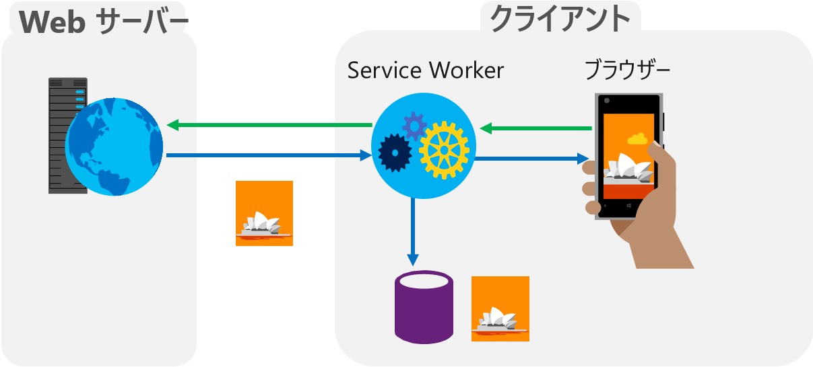
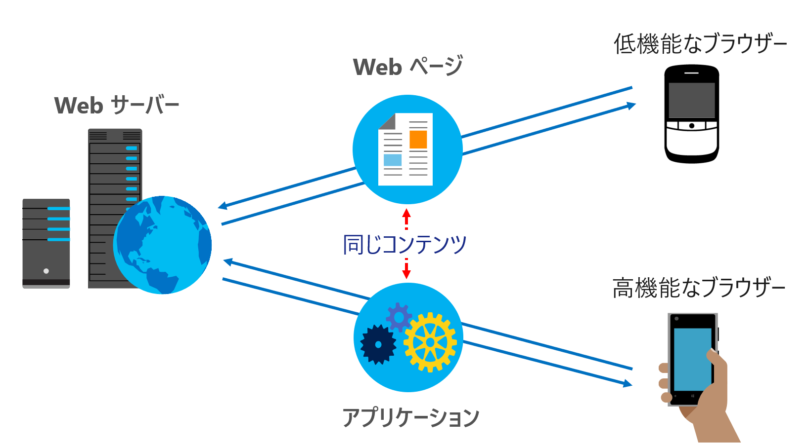
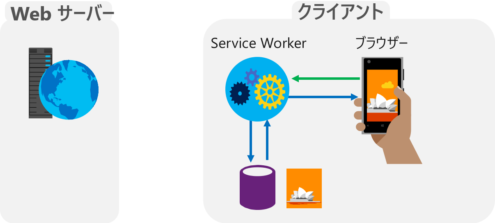
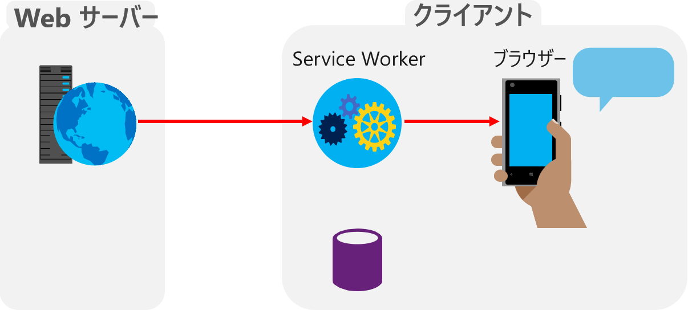
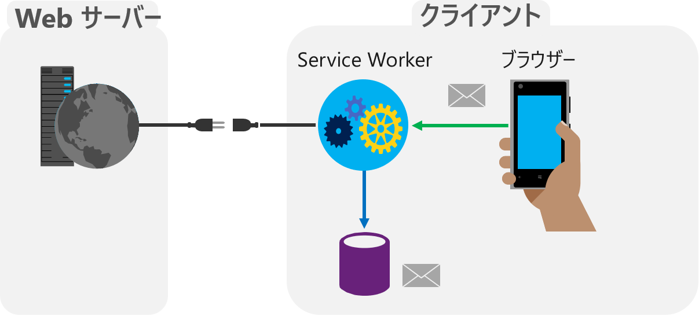
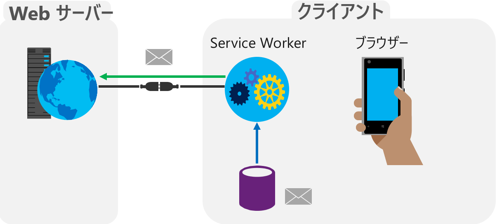

# 演習 9 : Progressive Web App(PWA) 化
これまで作成したゲームを Progressive Web App (PWA) 化してデバイスに直接インストールできるようにします。

## Progressive Web App (PWA) とは
PWA とは、Web クライアントのスペックに応じた体験を提供する Web アプリケーションの概念です。高機能な Web ブラウザーではネイティブアプリケーションに近い体験を提供することもできます。

PWA 化することによってマートフォンのホーム画面から直接ゲームを起動することができ、ゲームの動作に関係のないナビゲーションバーなどのWeb ブラウザーの UI を隠すこともできます。

また、このハンズオンで作成したゲームの動作は Web ブラウザー内で完結しているので、PWA 化すればオフラインでも使用することができます。


## タスク 1 : アイコンの準備
ゲームをアプリケーションとしてデバイスにインストールする際に
必要となるアイコンを準備してアプリケーションのディレクトリに配置します。

手順は以下のとおりです。

1. アイコンの作成、または入手
    このハンズオンのために用意されているアイコンを[**ここから**](assets/html5gameHandson_PWA_Assets.zip)ダウンロードします。

2. ダウンロードした zip ファイルを解凍し、展開された各ファイルと icons フォルダを以下のとおりに配置します。

    * ファイル名 **apple-touch-icon-数字x数字.png** ファイル

        ⇒ **ルートディレクトリ** (default.html と同じ階層)
    * **icons** フォルダー

        ⇒ **img ディレクトリの中**

配置し終えたら Visual Studio Code から正しい位置に配置されているか確認してください。

## タスク 2 : マニフェストファイル (manifest.json) の作成 
PWA の設定ファイルである manifest.json を作成します。

このファイルではアプリケーションの名前やアイコン、アプリケーション ウィンドウの表示形式などを指定します。

作成手順は以下のとおりです。

1. Visual Studio Code にて、ルートディレクトリに manifest.json という名前で空のファイルを作成します。

2. manifest.json 開き、以下の設定をコピーして貼り付けます。
    ```
    {
        "name": "html5GameHandson-SnowCatch.",
        "short_name": "SnowCatch*",
        "icons": [
        {
            "src": "apple-touch-icon-72x72.png",
            "type": "image/png",
            "sizes": "72x72"
        },{
            "src": "apple-touch-icon-76x76.png",
            "type": "image/png",
            "sizes": "76x76"
        },{
            "src": "apple-touch-icon-120x120.png",
            "type": "image/png",
            "sizes": "120x120"
        },{
            "src": "apple-touch-icon-144x144.png",
            "type": "image/png",
            "sizes": "144x144"
        },{
            "src": "apple-touch-icon-152x152.png",
            "type": "image/png",
            "sizes": "152x152"
        },{
            "src": "apple-touch-icon-180x180.png",
            "type": "image/png",
            "sizes": "180x180"
        },{
            "src": "img/icons/icon-96x96.png",
            "type": "image/png",
            "sizes": "96x96"
        },{
            "src": "img/icons/icon-128x128.png",
            "type": "image/png",
            "sizes": "128x128"
        },{
            "src": "img/icons/icon-192x192.png",
            "type": "image/png",
            "sizes": "192x192"
        },{
            "src": "img/icons/icon-384x384.png",
            "type": "image/png",
            "sizes": "384x384"
        },{
            "src": "img/icons/icon-512x512.png",
            "type": "image/png",
            "sizes": "512x512"
        }],
        "start_url": "./",
        "display": "standalone",
        "background_color": "#ffffff",
        "theme_color": "#000000"
    }
    ```
3. キーボードの [Ctrl] + [S] を押下して manifest.jon を保存します。

4. default.html を開き、\<title\> タグの下の行に以下のマークアップをコピーして貼り付けます。
    ```
    <link rel="manifest" href="manifest.json">
    ```
5. キーボードの [Ctrl] + [S] を押下して default.html 保存します。

## タスク 3 : Service Wroker 用 JS ファイルの作成

Service Wroker は端的に行ってしまえば**プログラミング可能なプロキシ**です。

Service Wroker は管理スコープ内にある *.html などの Web コンテンツをローカルにキャッシュし、リクエストをハンドリングしてキャッシュされた内容を返したり、ページが非アクティブであってもバックグラウンドで動作しつづけ通知を行ったりもできます。



今回のハンズオンではこの Service Worker の機能を利用して、アプリケーション全体をデバイスローカルにキャッシュ、オフライン状態でも使用できるようにします。

Service Worker は専用の *.js ファイルを用意し、その中に制御を行うためのコードを記述します。

アプリケーション側では、Service Worker 用の JS ファイルを登録するだけで透過的に使用することができるため、既存のアプリケーションで Service Worker を使用する場合でもコードの修正はほとんど必要ありません。

ハンズオンで作成したゲームが Service Worker を利用するための手順は以下のとおりです。

1. Visual Studio Code にて、ルートディレクトリに sw.js という名前で空のファイルを作成します。
2. sw.js を開き、以下のコードをコピーして貼り付けます。
    ```
    //キャッシュの名前
    const CACHE_NAME = 'html5gameHandson-asset0820';
    //キャッシュするアセット類を指定
    var assetsToCache = [
            '/',
            '/default.html',
            '/css/default.css',
            '/scripts/default.js',
            '/img/snow_man.png',
            '/img/snow.png',
            '/img/sp_snow.png',
            '/audio/kiiiin1.mp3',
        ];
    /*ここにインストール イベントのハンドラを記述します*/ 
    /*ここにアクティベイト イベントのハンドラを記述します*/ 
    /*取り出しイベントのハンドラを記述します*/ 
    ```
    このコードでは、Servive Worker が使用するキャッシュの名前、とキャッシュするアセット(ファイル)を指定しています。

3. Service Worker がインストールされた際のイベントハンドラを記述します。

    ここでは前の手順で設定したキャッシュの名前でキャッシュを作成し、同じく前の手順で指定したアセットのリストに指定されたファイルをキャッシュします。

    sw.js のコメント「/* ここにインストール イベントのハンドラを記述します*/ 」) を以下のコードで置き換えます。
    ```
    //インストール イベント (キャッシュを行う)
    self.addEventListener('install', function(e) {
        e.waitUntil(
            caches.open(CACHE_NAME).then(function(cache) {
                return cache.addAll(assetsToCache);
            })
        );
    });
    ```

4. アクティベイト時のイベントハンドラを記述します。

    ここでは古いキャッシュを削除するための処理を記述しています。

    Service Worker のキャッシュは Service Worker の更新を行っても自動では削除されないのでコンテンツを更新するにはどこかでキャッシュ削除を行う必要があります。

    sw.js のコメント「/* ここにアクティベイト イベントのハンドラを記述します*/」) を以下のコードで置き換えます。

    ```
    //アクティベイト イベント (古いキャッシュを削除する)
    self.addEventListener('activate', function(e) {
        e.waitUntil(
            caches.keys().then(function(keyList) {
                return Promise.all(keyList.map(function(key) {
                    //今回指定されたキャッシュの名前と違う場合は
                    if (key !== CACHE_NAME) {
                    //キャッシュを削除する
                    return caches.delete(key);
                    }
                }));
            })
        );
    });
    ```
    このコードでは、単純に今回使用しているキャッシュの名前と違うものを削除していますが、実際の運用では、きちんとしたキャッシュ戦略を立てそれに沿ったロジックで実装することをお勧めします。

5. コンテンツの取り出しの際のイベントハンドラを記述します。

    fetch イベントハンドラの引数として要求されたファイル名が渡されるので、キャッシュ内を検索し、該当するもがあればそれを返し、存在しない場合は Web サーバーにリクエストして結果を返します。

    sw.js のコメント「/* 取り出しイベントのハンドラを記述します*/ 」) を以下のコードで置き換えます。
    ```
    //取り出し時のイベント (キャッシュから取り出す)
    self.addEventListener('fetch', function(e) {
        e.respondWith(
        caches.match(e.request).then(function(response) {
            return response || fetch(e.request);
        })
        );
    });
    ```
6. キーボードの [Ctrl] + [S] を押下して sw.js を保存します。

7. default.html を開き、コメント「\<!-- ここに演習 9 のタスク 3 で Service Worker を呼び出す記述をします-->」を以下のマークアップで置き換えます。
    ```
    <script>
        if (navigator.serviceWorker) {
            navigator.serviceWorker.register('sw.js');
        } 
    </script>
    ```
8. キーボードの [Ctrl] + [S] を押下して default.html 保存します。

9. Visual Studio Code のターミナル画面から **http-server** を起動します。
    <p style="text-indent:2em">
    <a href="http://127.0.0.1:8080/default.html">http://127.0.0.1:8080/default.html</a></p>
10. コマンドプロンプトを起動し、cd コマンドで作業ディレクトリを ngrok.exe が配置されているディレクトリに切り替えます
11. 以下のコマンドを実行して cmd にシェルを切り替えます。

    ***cmd**

12. 以下のコマンドを実行します

    **ngrok http 8080 --host-header=localhost**

13. エコーされた内容の Foewarding の横に表示された http、もしくは https のドメイン名を使用してアクセスします

    
    たとえば、ngrok から返されたドメイン名が http://9fcf38b6.engrok.io だった場合は以下の URL でインターネットからローカルの default.html にアクセスすることができます。
    
    http://9fcf38b6.engrok.io/default.html

14. スマートフォンの Web ブラウザーからアクセスして、ページが表示されることを確認します。

15. 以下の手順でデバイスにインストールを行います。

    1. iPhone ではモバイル Safari の \[追加・共有・保存\] ボタンをクリック
    
        Android では Chrome の […] ボタンをクリック
    2. メニュー一覧から \[ホーム画面に追加\] をクリック
    3. 画面右上の [追加] メニューをクリック

ホーム画面のアイコンをタップしてゲームが起動するか確認してください。

ここまでの sw.js の完全なコードは以下になります。

* [**HTML5 game and PWD HOL Ex9 SW sample code**](https://gist.github.com/osamum/4c526fa7845294fd2848f036cc4080f0)

実際のコードの動作を確認したい場合は[**ここ**](https://osamum.github.io/HTML5Game_and_PWA_Handson/results/ex9/default.html)をクリックしてください。

# 解説
## Progressive Web App とは?
Progressive Web App (以下 PWA と記述) は、一言でいうならば「ネイティブアプリのような UX を提供する Web アプリの概念」といったところでしょう。
PWA というと、"ネイティブアプリのような体験" という特徴ばかりが注目されますが、大きな特徴がもうひとつあります。それは、PWA という名前にも含まれている Progressive というところです。

これは HTML5 が普及しはじめたころにあった、「HTML5 が解釈できるモダンブラウザーにはリッチな体験を、そうでないブラウザーには従来とおなじ体験を」というデザインの考え方 Progressive Enhancement に由来します。

PWA はこの思想を踏襲し、性能の低い Web ブラウザーを切り捨てることなく、クライアントの性能に合わせた機能提供を行います。

PWA は、性能の低い Web ブラウザーからアクセスがあった場合は従来と同じ Web ページとして動作し、PWA が動作する機能を備えた Web ブラウザーからアクセスがあった場合は、その機能を活かし、これまでの Web アプリには無かったネイティブアプリのような体験を提供します。



## Progressive Web App を実現する機能
それでは、"これまでの Web アプリには無かったネイティブアプリのような体験" というのはどのようなものがあるでしょう? 

代表的なものとしては以下の 4 つが挙げられ、それぞれに対応する新しい API によって実現されます。

1. オフラインサポート - [**Cache API**](https://developer.mozilla.org/ja/docs/Web/API/Cache)
2. プッシュ通知 - [**Push API**](https://developer.mozilla.org/ja/docs/Web/API/Push_API)
3. バックグラウンド処理 - [**Background Sync**](https://github.com/WICG/BackgroundSync)
4. デバイスへのインストール(デバイスのホーム画面から起動できる) - [**Web App Manifest**](https://developer.mozilla.org/ja/docs/Web/Manifest)

そして、これらの機能を提供しているのが 1 ～ 3 が Service Worker で、 4 が Web App Manifest です。

PWA の定義に明確なものはありませんが、上記の機能の中からオフラインサポートと、インストール(アイコンをデバイスのホーム画面に追加)機能をサポートしていれば、PWA を名乗ってもそう否定されることはないでしょう。

これらの機能により、デバイスのホーム画面から、ナビゲーションバーなどのブラウザー UI が無い状態でアプリケーションを起動し、オフラインの状態でも使用できる、という体験をユーザーに提供できます。

これらの体験は、これまでの Web アプリケーションには無かったネイティブアプリのならではのメリットと言えるでしょう。

## Progressive Web App が提供する価値
Progressive Web App は前出のこれまで Web アプリケーションには無かったネイティブアプリのならではのメリットと、従来の Web アプリケーションならではのメリットを両方提供できます。

特徴的なものとしては、以下があります。

### 発見性
PWA であれば、アプリを公開するのにアプリ ストアにわざわざお金を払ってアプリを提出したり、審査を通すための不自由なルールに縛られる必要はありません。
これまでの Web アプリと同じようにインターネットに公開しておけば、検索エンジンがクロールして見つけてくれます。

いままでの SEO のスキルがそのまま使えるうえ、Web は、アプリ ストアとは比べものにならない数のユーザーが、比べものにならないくらいの回数、常に検索を行っています。

この圧倒的なオポチュニティ(機会)の違いは、自分自身が今日何回 Web を検索したか、アプリストアを検索したか、比べてみればよくわかるでしょう。

### インストール可能
PWA はさまざまなデバイスにインストール可能ですが、そのためにプラットフォームごとに違う開発言語で書き直したりパッケージンクしなおしたりする必要はありません。

PWA をサポートしている Web ブラウザーであれば、同じアプリケーションをその全部にインストールして使うことができます。

また、"インストールしなくても使える" 点もメリットです。
もともとが Web ページなので、ちょっとだけ使ってみるということが可能です。
サービスを試用してみようと思ったときに、"アプリのインストールが障壁になって利用を中断してしまった"、という経験は誰にでもあることでしょう。

また、スマートフォンでコンテンツを閲覧中に、突然、アプリのストア画面が表示され、アプリのインストールを促されて不快な思いをしたこともあるかと思いますが、そういったことを避けられます。

PWA であれば提供者もユーザーもアプリのインストールについてのネガティブな点を回避することができます。

### 再エンゲージ可能
従来の Web ページであれば、ユーザーがコンテンツから離脱したあとは、再び訪問してくれることを祈るくらいしかできませんでしたが PWA はサーバー側から通知を Push することができます。

これによりユーザーに即時的な価値を提供できます。例えば、EC ショップであればタイムセールの開始であるとか、オークションサイトであればオークションの開始や、最高落札額の更新などを知らせることができます。通知機能を適切に利用することで、ユーザー側の機会獲得を増やし、再エンゲージを促すことができます。逆にどうでも良いことを通知しすぎるとユーザーの心象を害するので注意が必要です。

とくに、初めてページを訪問したユーザーに「プッシュ通知を許可しますか?」というメッセージを表示するのは避けたいところです。
 
### ネットワーク非依存
PWA はオフラインでの使用が可能ですので、ネットワークの状態に左右されないように作ることができます。また、常に使用されるアセットをローカルにキャッシュすることで表示のスピードアップや、回線の使用料を減らすことにも貢献します。

### プログレッシブとレスポンシブ
PWA はきちんとその思想を理解してつくれば、低機能なブラウザーや PWA をサポートしないデバイスにもサービスを提供できます。また、さまざまな画面サイズに対応するためのレスポンシブな機能については、Web には Media Queries 等、そのためのナレッジもリソースも豊富に存在するため、既存のスキルを活かして機能を実装できます。

### 安全
PWA は Web コンテンツと同じ Web ブラウザーの強力なサンドボックス内で動作するため、ネイティブアプリのようにユーザーの強い権限で動作して誤動作や悪意のあるコードによってシステムに深刻なダメージを与えることはありません。また https でしか動作しないためサーバーとのやりとりを安全に行うことでできます。

### リンク可能
PWA はインターネット上でユニークな URL をもっており、ハイパーリンクのあるさまざまなところからサービスに接続することができます。PWA を使用するのにアプリ ストアも、面倒なインストールプロセスも必要ありません。

PWA のメリットは、Web とネイティブ アプリのメリットを合わせたということだけでなく、それらを状況に合わせて取捨選択できることです。

## Progressive Web Apps を実現する API
PWA を実現するうえで中心となる機能を提供するのが Service Worker です。
Service Worker とはなにか?、端的に言うと、「バックグラウンドで動作する **"プログラミング可能な"ネットワークプロキシ**」です。

Service Worker は Web Worker の一つで、Web ページのスクリプトとは独立して動作しており、DOM にアクセスしたりすることはできませんが、Web ページのネットワーク リクエストすべてをインターセプトできます。

つまり、Web ページからのリクエストを横取りしてキャッシュしたものを返したり、改ざんしたりといったことができます。そのため localhost、127.0.0.1 接続以外は https の使用が必須となります。

### Service Worker が提供する機能
Service Worker は主に以下の四つの機能を提供します。

* キャッシュ
* リクエストのハンドリング
* Push 通知
* バックグラウンド同期

#### キャッシュとリクエストのハンドリング
Service Worker は Web ページからのリクエストの中に、自分のキャッシュリストに含まれるアセットを見つけると、レスポンスからこれを取得してキャッシュします。


それ以降、Web ページからリクエストされたアセットがキャッシュ内に存在する場合は、そのキャッシュされたアセットを返します。ネットワークから取得しないので、アセットの取得は高速に完了し、通信コストは発生しません。



#### Push 通知
関連付けられた Web ページがアクティブでなくても、サーバーからの Push を受け取り Notification API 等を使用してユーザーに通知を行えます。



#### バックグラウンド同期
オフライン中にユーザーが行った操作をキャッシュし、



オンライン時にその内容を同期することができます。



このように Service Worker は**プログラミング可能なネットワークプロキシ**として、これまでにないさまざまな機能を提供します。

### Web App Manifest
Web App Manifest は、デバイスのブラウザーによって \[ホーム画面に追加\] される際のアイコンや、ホーム画面から起動した際のスプラッシュアイコンや背景色、アプリケーションが動作するウィンドウのスタイルを定義します。

以下に簡単な説明を兼ねたサンプルを掲示します。
```
{
   "lang": "ja", ← 言語
    "name": "The enemy of galaxy", ← アプリケーションの名前
    "short_name": "T.E.O.G", ← アプリケーションのショートネーム
    "start_url": "/?utm_source=pwd", ← 開始するときの URL (※1)
    "display": "standalone", ← ウィンドウのスタイル
    "background_color": "black", ← 背景色
    "description": "銀河に平和を取り戻すためのゲームです。", ← 説明文
    "orientation": "portrait" ← 画面の向き
    "icons": [{ (※2)
        "src": "images/homescreen48.png", ← 画像ファイルのパス
        "sizes": "48x48", ← サイズ
        "type": "image/png" ← 画像の種類
      }, {
      "src": "images/homescreen72.png",
      "sizes": "72x72",
      "type": "image/png"
   }]
} 
```
(※1)Google Analytics 等を使用しているときはクエリーストリングを使用することで PWA として起動されたのか、ブラウザからページにアクセスしたのか判断が可能

(※2)iPhone や iPad でアイコンが反映されない場合は apple-touch-icon を使用

## \<参考\>
PWA についてのより詳しい内容は以下の記事をご参照ください。

* [**de:code2018セッションフォローアップ「進化する Web ～ Progressive Web Apps の実装と応用 ～」**](https://blogs.msdn.microsoft.com/osamum/2018/07/03/about_pwa/)


[0. 最初に戻る](README.md)

[1. 開発環境の準備とプロジェクトの作成](html5_game_HOL01.md)

[2. Canvas への画像のロード](html5_game_HOL02.md)

[3. 基本的なアニメーションの実装](html5_game_HOL03.md)

[4. 矢印キーとタッチによる制御](html5_game_HOL04.md)

[5. あたり判定](html5_game_HOL05.md)

[6. 複数 Sprite の生成とランダムな動作](html5_game_HOL06.md)

[7. ヒット時の画像の切り替えと効果音の実装](html5_game_HOL07.md)

[8. ルールの追加](html5_game_HOL08.md)